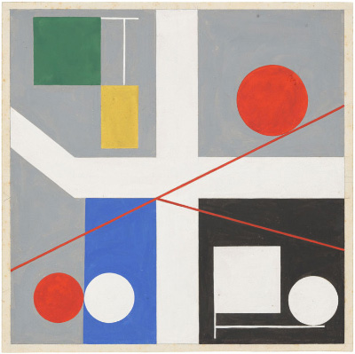

[Previous Section: Project](2_EXERCISE.md)

# Module 1: Project

## 

Painting by Sophie Taeuber-Arp, 1932.

## Drawing with Code

Drawing with code means interpreting the  shapes, colors and sizes in a work and translating them into a language  the computer understands.

## Instructions

### Step 1: Find a Painting to Work From

For this assignment we will be drawing inspiration from the history of geometric abstraction in painting. You will be doing some online research and **choosing one painting** as the inspiration for your first SwiftProcessing sketch. You may choose any painting you find online that involves geometric abstraction or hard edge painting. Some artists I recommend you search are: László Moholy-Nagy, Kazimir Malevich, Sophie Taeuber-Arp, Sarah Morris, Maya Hayuk, Robert Delauney, Victor Vasarely, Vera Molnar, and Bridget Riley.

### Step 2: Select an Interesting Crop

First **select an** **interesting/ambitious crop**, then load it into a program such as Adobe Photoshop or GIMP to read the color and coordinate data.

### Step 3: Gather Coordinate and Color Data Using Photoshop or GIMP

Use at least the following functions for drawing:  `line()`, `quad()`, `rect()`, `ellipse()`, `arc()`, and `beginShape()`,  `endShape()`, `curveVertex()`, and `vertex()`.

The goal for this project is to translate the  painting into code.

## Student Examples

The following are student examples used with permission:

Coming Soon.

## Rubric

| Criteria                                                     | Points |
| ------------------------------------------------------------ | ------ |
| Uses the shape functions learned in the module to create an interesting/ambitious crop of the image. | 10 pts |
| Uses color to accurately reproduce the image selected and demonstrates knowledge of using color in code. | 10 pts |
| Code has a clear, descriptive header. Code is helpfully commented for your future self. | 5 pts  |

[Next Section: Module 2](../2_ColorLoopsAnimation/README.md)

