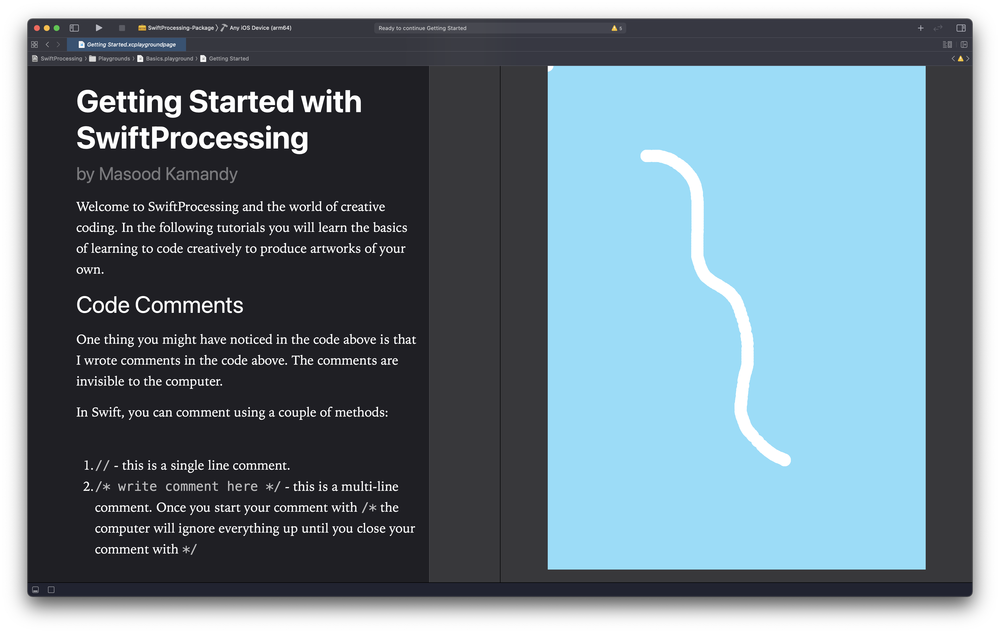

# Module 1: Drawing with Code

## Introduction

In this course you will learn how to code by doing something you already know how to do: draw! Whether you doodle, only practiced art when you were little, or are a practicing artist, making art is something most people can relate to. Learning how to code using existing metaphors helps ease the process into programming.

The framework we'll be using for this course is called SwiftProcessing. It's a subset of the Processing language translated into Swift for iOS devices. The framework is designed to be as close to Processing and p5.js as possible without sacrificing any of the benefits that Swift and Xcode brings us.

For this course we'll be working in a lot in Playgrounds in Xcode. Playgrounds are a simplified code editor that enable the combination of code and explanatary text. Your textbook for this course is in the form of Playgrounds. They also enable you to see a live view of your code beside your editor in the same window so you have instant feedback.

[Next Section: Reading](1_READING.md)

