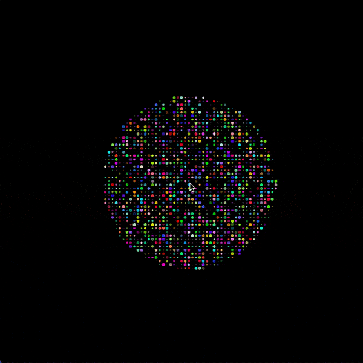
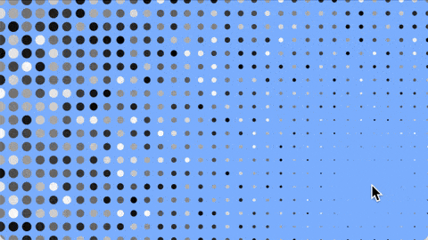

[Previous Section: Reading](1_READING.md)

# Module 2: Exercise

## For Loop & Repetition


## Introduction

**For loops** allow you to create complex structures and **repeat code** in powerful ways to accomplish a lot with just a few lines. If you find yourself repeating yourself when you're coding, it's always a good idea to think about whether a for loop might work better.

In this exercise we're going to practice with one of the more challenging ways of using for loops that is very useful. We're going to need to work in two dimensions, so we'll have to count in two directions. For that we'll use a **nested for loop** and it means putting one for loop inside another.

In **psuedocode** (not real code), the basic process of working in two dimensions looks like this:

```pseudocode
for x from 0 to xMax { // For horizontal coordinates.
	for y from 0 to yMax { // For vertical coordinates.
		drawShape(x, y)
	}
}
```

Use what you've learned in your readings to translate the above code into Swift!

## Instructions

Create a **nested for loop that fills the canvas with a grid of circles**. You can decorate them any way you'd like. You can use the image above  for inspiration or draw from art history. You can also create more complex shapes if you'd like.

**Incorporate touch** (both X and Y position using the `touchX` and `touchY` keywords demonstrated in the *Getting Started* Playground of your reading) to manipulate the circles in some way. Here are a few options:

\- Touch position increases the number of circles.
\- Touch position affects the size of the circles.
\- Touch position affects the colors of the circles.
\- Any combination of the above!

You must **use a for loop**.

You must also **incorporate randomness** in some way. Use your Playground textook chapter titled *Randomness* to guide you.

The `random()` function is explained on the *Randomness* chapter of your Playground textbook.

There must be **at least 100 circles** when the screen is totally filled, but feel free to make more if you need.

## Student Examples

The following are student examples used with permission:



Image by Scott Wu



Image by Valarie Chiu

## Rubric

**Note:** Code must function in order to earn credit.

| Criteria                                                     | Points |
| ------------------------------------------------------------ | ------ |
| **Technique**<br />- Correctly uses a **nested for loop** to create a grid of objects. | 1 pts  |
| **Conceptual Understanding**<br />- Sketch is **animated**<br />- Incorporates **randomness**<br />- **Mouse position** changes the appearance of the grid or shapes. Mouse should be integrated in for loop. | 1 pts  |
| **Presentation**<br />- Code has a clear, descriptive **header**.<br />- Code is helpfully **commented** for your future self.<br />- Code is **auto-formatted** (select all and Control-i) so that tabs are correct.<br />- The code is presented neatly **without** commented out code. | 1 pts  |

[Next Section: Project](3_PROJECT.md)