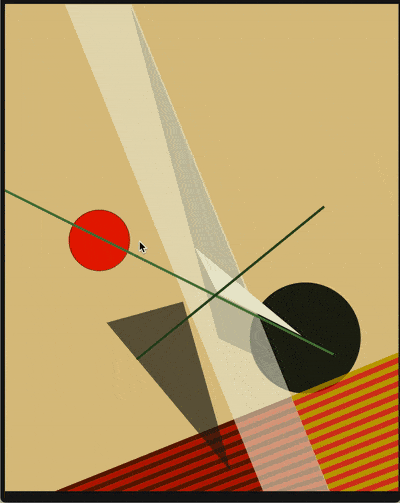

[Previous Section: Exercise](2_EXERCISE.md)

# Module 2: Project

Animated version of László Moholy-Nagy's *Composition A XXI* (1925) by Carlos Monterosa.

## Animation & Interaction

In the previous module you learned how to draw using code, but what you drew was a **static image**. In this assignment we're going to bring your previous sketch to life and **learn how to animate** and **make it interactive** using **touch** input.

## Instructions

Modify your code for *Module 1: Drawing with Code* to **make the image respond to touch**. Do this by adding variables to your program and controlling your custom variables with the built-in SwiftProcessing variables **`touchX`** and **`touchY`**.

This will enable your work to be **animated** and **interactive**.

Think about how the motion from your user's touch should aesthetically affect the lines and shapes. 

## Student Examples

**Note:** The examples I provide are meant to only give you an idea of what's expected. **Do not copy them. All of your ideas in this course must be original.** Create your own approach to all assignments. Copies will receive no credit.

The following are student examples used with permission:

Image by Scott Wu

## Rubric

**Note:** Code must function in order to earn credit.

| Criteria                                                     | Points |
| ------------------------------------------------------------ | ------ |
| **Technique** - Uses **touch** (**`touchX`** and **`touchY`** or the **`touchStarted`, `touchMoved`, or `touchEnded`** functions). - Uses **keyboard** (the **`key`** variable or **`keyPressed`** function). - Uses **clearly named variables to control all movements**. Variable names should refer to their function. Avoid single letter variable names and serial numbers (x, y, z, x1, x2, x3, etc.). They should be more descriptive. | 1 pts  |
| **Conceptual Understanding** - Sketch is **interactive**. - Interactivity adds **basic, input-based animation** to the sketch. | 1 pts  |
| **Presentation** - Code has a clear, descriptive **header**. - Code is helpfully **commented** for your future self. - Code is **auto-formatted** (select all and control-i) so that tabs are correct. - The code is presented neatly **without** commented out code. | 1 pts  |

[Next Section: Module 3](../3_Motion_Collage_and_Images/README.md)

