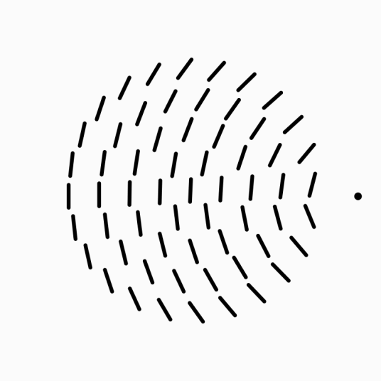

[Previous Section: Project](2_EXERCISE.md)

# Module 2: Project

## 

## Animation & Interaction

In the previous module you learned how to draw using code, but what you drew was a **static image**. In this assignment we're going to bring your previous sketch to life and **learn how to animate** and **make it interactive** using **touch** input.

## Instructions

Modify your code for *Module 1: Drawing with Code* to **make the image respond to touch**. Do this by adding variables to your program and controlling your custom variables with the built-in SwiftProcessing variables **touchX** and **touchY**.

This will enable your work to be **animated** and **interactive**.

Think about how the motion from your user's touch should aesthetically affect the lines and shapes. 

## Student Examples

The following are student examples used with permission:

Coming Soon.

[Next Section: Project](../3_Motion_Collage_and_Images/0_INTRODUCTION.md)