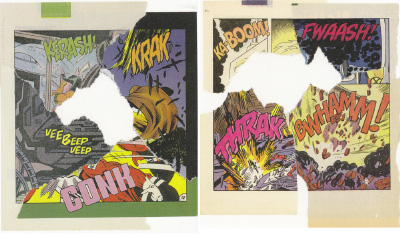
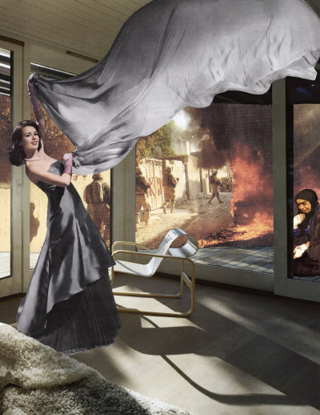

[Previous Section: Reading](1_READING.md)

# Module 3: Exercise

## Collage (Still)

Artwork by [John Stezaker](https://en.wikipedia.org/wiki/John_Stezaker)

## Introduction

> “Collage is an ancient art. It was used  by calligraphers in tenth century Japan, and may be seen in the  gold-leaf panels in European cathedrals of the fifteenth and sixteenth  centuries, as well as in the nineteenth century collagist techniques of  such figures as Hans Christian Anderson. However, it was during the  Modernist era that the genre really came into its own. Ever since Pablo  Picasso and Georgue Braque began to use the technique in their paintings and drawings in the early 1900s, collage, as an artistic practice, has  flourished.”
>
> —From the introduction of *Collage: Assembling Contemporary Art*

## Instructions

Use what you’ve learned about **loading image elements** to create a self-generating collage that follows these rules. The sketch should:

- **Generate a new collage each second** using **`frameRate(1)`.**
- Create the collage from **a set of at least 10 images**.
- Have a clear **compositional logic**.
- Utilize **random numbers** for size, position, and/or color.
- Run **infinitely**.

The idea is to encode **compositional logic** into the generator, so elements have relationships.

### What is Compositional Logic?

Let's talk about  **what compositional logic means**. In a collage, compositional logic has to do with the relative **size** and **placement** of different images in relation to one another. One example is the compositional logic of a landscape image. A landscape may include land at the bottom, mountains in the middle, and sky elements up above.  Another example could be a space image. In an image of a moon with a  space station orbiting it,  the image of the moon is large. It may be in the center. The photo of the space station is small. That size  difference, and the placement of all of the images is the compositional  logic.

Can you think of other types of images that have compositional  logic?

### Plan Your Collage

Develop a **precise plan** by sketching on paper for how your collage images relate to each other and implement these relationships in code.

Use only **your own media**, media that you have **transformed** or media that you have **permission to use**. [Flickr Commons](https://www.flickr.com/commons) is a good source if you don’t want to use your own photos or scans.

It is recommended to **resize your images** to the maximum size that they are used. Large images can slow down your sketch.

There are a couple of SwiftProcessing functions you will definitely want to use in this exercise: `random()` and `frameRate()`. We've already used random quite a bit, but `frameRate()` might be new. `frameRate()` takes in a parameter is the number of frames per second you'd like your sketch to run at. The default value is `60`, so most of your sketches will try to run at 60 frames per second. For this sketch you'll want to set it to `1`.

## Examples of Collage Across Different Media

### Christian Marclay

[Link to Video](https://vimeo.com/176259496)

### Martha Rosler

### John Stezaker

## Student Examples

The following are student examples used with permission:

Coming soon.

## Rubric

| Criteria                                                     | Points |
| ------------------------------------------------------------ | ------ |
| Your collage recreates itself every second from a pool of 10 images (at least). | 10 pts |
| The `random()` function is used.                             | 10 pts |
| Collage has a clear compositional logic.Code has a clear, descriptive header. Images are not just random on the canvas. | 10 pts |
| `frameRate(1)` is used and is located in the correct place.  | 10 pts |
| Code is helpfully commented for your future self.            | 10 pts |

[Previous Section: Project](3_PROJECT.md)

