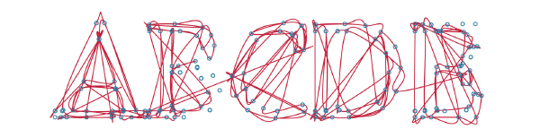
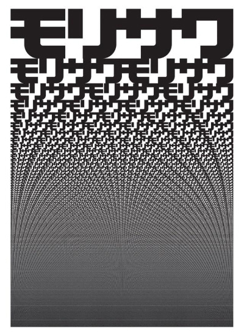

[Previous Section: Exercise 1](2_EXERCISE.md)

# Module 4: Exercise 2

## Generative Typography with Functions

Type design by [Daniel Davis](https://www.danieldavis.com/parametric-typography/).

## Instructions

1. **Select a sequence of three or four letters**, then **research** the different ways each letter can be written through examining different typefaces, both historical and contemporary.
2. Make a series of **sketches and drawings on paper** for how you will draw your letters with code.
3. Next, **write one function to draw each letter using the various drawing and shape functions** available to you you've learned in this class, i.e. `line()`, `vertex()`, `curve()`, `rect()`, etc. For instance, if you select M, A, and K, you'll have three functions called something like `drawM()`, `drawA()`, `drawK()`, etc.
4. Then, **add parameters to each function** to change the visual quality of each letter. For instance, make it possible to change the x or y position, the thickness and/or the x-height through  parameters.
5. Finally, write **another function that draws all the letters** in their sequence. For example, you could create a function that is called `drawMAK()` or `drawAll()`. **Note:** This function will simply contain the individual letter functions.
6. **Update your letters once each second** with different random parameters.

Submit both inspiration/research and process images (screen shots and scans of sketches) and your finished file. You can simply **zip** it all in a single folder.

**No pre-made fonts for this assignment.** Your typography should be composed of all of the line/shape functions we have learned so far or any other method for creating primitive shapes you have researched.

## John Maeda

Processing emerged out of the Massachusetts Institute of Technology (MIT) Media Lab's Aesthetics + Computation group. It was created by Casey Reas and Ben Fry and emerged from working with their advisor John Maeda and continuing his work called [Design by Numbers](https://en.wikipedia.org/wiki/Design_By_Numbers).

In 1996, [John Maeda](https://maedastudio.com/) experimented with PostScript, a programming language created by Adobe which is specifically for outputting crisp vector graphics to the printed page, to create [a series of posters](https://maedastudio.com/morisawa-10-2016/) for the Morisawa font company. The poster below is a seminal example of how typography and generativity can be combined.

## Student Examples

The following are student examples used with permission:

Coming soon.

## Rubric

| Criteria                                                     | Points |
| ------------------------------------------------------------ | ------ |
| Project has 3 letter functions with parameters that make sense and a 4th function with paremeters that calls the other 3 functions together. | 10 pts |
| Typographic research was included with the project.          | 5 pts  |
| Updates once per second with randomness.                     | 5 pts  |
| Code is helpfully commented for your future self.            | 5 pts  |

[Next Section: Project](4_PROJECT.md)

