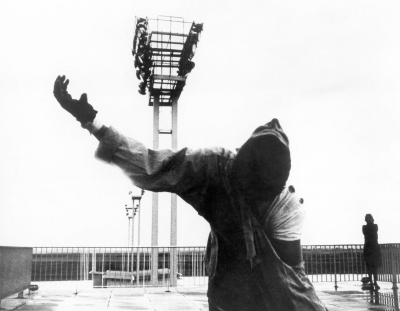
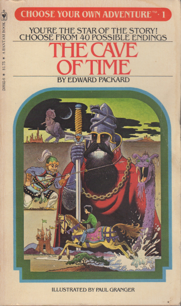
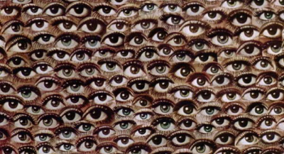
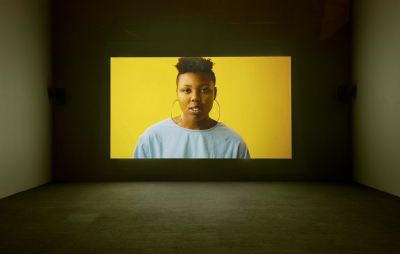

[Previous Section: Exercise 2](3_EXERCISE.md)

# Module 4: Project

## Expanded Cinema Part 1

A still from *La Jetée* (1962) by Chris Marker.

## Introduction

> "Expanded cinema is used to describe a film, video, multi-media performance or an immersive environment that pushes the boundaries of cinema and rejects the traditional one-way relationship between the audience and the screen."
>
> —From [The Tate Museum's *Art Terms*](http://www.tate.org.uk/art/art-terms/e/expanded-cinema))

In this assignment you will create a cinematic experience that moves  beyond the traditional definition of cinema and creates an experience  that changes every time its run.

## La Jetée

The French filmmaker [Chris Marker](https://www.youtube.com/watch?v=1HrujmaJ5zU) is one of the pioneers of experimental cinema. **La Jetée** is a science fiction film created in 1962 using **only still images and a voice over**. Its time-travel narrative is non-linear. The film later became the inspiration for Terry Gilliam's film ***12 Monkeys***. 

Watch the film as inspiration for your project. The film is [viewable here](https://www.youtube.com/watch?v=fU99W-ZrIHQ).

## Instructions

You will work on this project over **two modules**. You'll need the time.

You will be creating a **looping**, cinematic experience that is **different each time through the cycle**. Use ideas found in modern **video games**, Chris Marker's ***La Jetée***, **animated GIFs**, and ***Choose Your Own Adventure*** novels as a start to write a program that sequences graphics,  photographs, or video into a continuous cinematic experience of your own creation.

A good example of this kind of film making that goes beyond a linear narrative is Netflix's ***[Bandersnatch](https://www.netflix.com/title/80988062)*** or HBO's ***[Mosaic](https://www.hbo.com/mosaic)***.

Another inspiration can come from the ***Choose Your Own Adventure*** series of books, which offered readers multiple possible endings.

## Deliverables for Part 1

**Submit:**

1. Flowchart, sketches, and/or your prototype that shows the overall structure of your cinematic experience.
2. Submit a folder with all of the images (12 minimum) you'll use in all of your scenes (6 minimum).
3. Submit a skeleton codebase populated with one example scene that shows how you will use a switch statement, if statement, or a combination of both within your project.

## Recommended Approach

There are many different approaches to completling this assignment, but one that has been very successful among students has been using a `switch`. Information about how to use the `switch` structure in Swift are in your Playground textbook in the *Conditional Logic* Playground. You may also find *The Swift Programming Language*'s section on [Conditional Statements](https://docs.swift.org/swift-book/LanguageGuide/ControlFlow.html#ID127) helpful.

## Other Notable Inspiring Works

### Frank & Caroline Mouris's Frank Film (1973)

> Frank Film is a 1973 animated short film. Co-creator Frank Mouris reads a list of words starting with the letter "f". This  sound track is interwoven with the sound of his reading his  autobiography. The visual is an animated collage of photos collected from magazines. Frank made the film with Caroline Mouris. The sound  track was created by Tony Schwartz. 
>
> The movie won an Academy Award for Best Short Subject, Animated Films and has been selected for preservation in the United States National Film Registry.
>
> —UbuWeb

The video is [available on UbuWeb](https://ubu.com/film/mouris_frank.html).

### Arthur Jafa's Love is the Message, The Message is Death (2016)

> Jafa’s work is a seven-minute video made up of clips collaged from original and found footage. Distressing scenes of historic and contemporary violence inflicted on Black Americans by individuals and institutions are woven with scenes of religious ecstasy, athletic prowess, poetic and musical performance—what Jafa has called ‘a Black display of Black excellence.’
>
> —UbuWeb

The video is [available on UbuWeb](https://ubu.com/film/jafa_message.html).

## Student Examples

**Note:** The examples I provide are meant to only give you an idea of what's expected. **Do not copy them. All of your ideas in this course must be original.** Create your own approach to all assignments. Copies will receive no credit.

For finished Expanded Cinema examples, *see the Module 5 project page*.

The following are student examples used with permission:

### Flowchart Example

Flowchart by Cat Morse. In Cat's example she has a single beginning and ending, but 3 possible middle portions. This is one way of approaching this assignment.

Flowchart by Ziyu Zhang. This is a flow chart with a single beginning and 3 different endings. There are many different possible paths through the narrative.

Flowchart/prototype by Georgia Siapno. Georgia's approach was to create a flowchart that also planned out the interactive experience visually. It operates simultaneously as a flowchart and a prototype to talk about what it's like visually to walk through the software.

### Completed Project Examples

Sketch by Esme Puzio. In this expanded cinema narrative, the user navigates using the keyboard through a surreal landscape. The images are taken from Google Street View and modified for surreal effect. The goal is to find a magic eight ball hidden somewhere in the dream.

Sketch by Georgia Siapno. Georgia created a clickable interior that, when you clicked on the bed, took you into a randomly generated dream-like maze space. This project enabled Georgia to showcase her illustration skills and incorporated playfulness (like how clicking on the TV turned it on).

## Rubric

**Note:** Code must function in order to earn credit.

| Criteria                                                     | Points |
| ------------------------------------------------------------ | ------ |
| **Technique** - A **beginning codebase** is created that shows structure, the use of a **`switch`** - Show how you will **keep track of a user's progress** through the story using `integers`, `enums`, or some other form of state management. | 1 pts  |
| **Conceptual Understanding** - A minimum of **12 images** or image elements have been chosen for at least **six distinct scenes**. - You've **flowcharted** or otherwise **planned/prototyped** your project and documentation of your planning/prototype is included as a scanned PDF (must be oriented correctly). - Prototype shows that it's possible to navigate through story using **multiple paths**. | 1 pts  |
| **Presentation** - Code has a clear, descriptive **header**. - Code is helpfully **commented** for your future self. Code is **auto-formatted** (select all and control-i) so that tabs are correct. - The code is presented neatly **without** commented out code. | 1 pts  |

[Next Section: Module 5](../5_Classes_Objects_and_Arrays/README.md)

