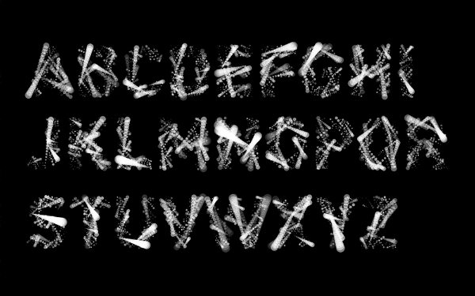

[Previous Section: Reading](1_READING.md)

# Module 5: Exercise

## Generative Typography with Objects

Type design by [Ze Wang](https://zewang.info/Generative-Typography).

## Instructions

Convert your *Generative Typography with Functions* workshop into **object-oriented notation**. You should have **three or four classes**, one for each letter. Then create a **fourth class** that **combines all four letters**.

## Student Examples

The following are student examples used with permission:

Coming soon.

## Rubric

| Criteria                                                     | Points |
| ------------------------------------------------------------ | ------ |
| Project has 3 letter objects, with a 4th object that contains the 3 first objects. | 10 pts |
| Updates once per second with randomness.                     | 10 pts |
| Code is helpfully commented for your future self.            | 5 pts  |

[Next Section: Project](3_PROJECT.md)

