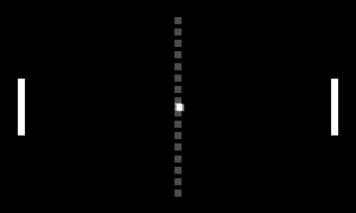

[Previous Section: Reading](1_READING.md)

# Module 6: Exercise

## Game Elements



Footage of the real Pong game [can be seen here](https://www.youtube.com/watch?v=fiShX2pTz9A).

## Introduction

While it wasn't the [first video game](https://www.bnl.gov/about/history/firstvideo.php), Pong is widely regarded as the video game which **marked the beginning of the home video game industry in the 70s**. It was a relatively simple game based on tennis where **two paddles** were used to hit a **ball** back and forth. Whenever a player missed the ball, the other player would get a **point**. Whoever gets ten points first wins.

Pong was released by Atari in 1972, first in the arcades and then as a home unit that connected to TVs. It was ultimately made available for the Atari 2600.

A digital tennis game like Pong is a great way of thinking through the idea of **object oriented programming**. It allows us to use physical metaphors to organize code in a logical, and consistent way for humans to understand.

## Instructions

We're going to divide the creation of a digital tennis game into 3 challenges and then put them all together to create the final game.

#### **Challenge 1: Paddle**

Create a single paddle using the **`rect()` function** with the following characteristics:

- The **paddle height** should be **20 px tall** and **100 px wide**
- The paddle should be positioned **20 px from the left edge**.
- **Use `touchX`** to control the x-position of the paddle.
- The paddle should stay **fixed in its y-position**.
- Use the **`constrain()` function** to constrain your y-position so that the paddle does not move off the screen.

#### **Challenge 2: Ball**

Create a white ball using the **ellipse() function** with the following characteristics:

- The ball **diameter** should be **20 px**.
- The ball should **start on the left edge** and move at a **random angle** to the right.
- The ball should **detect when it hits the top and bottom of the canvas** and **bounce**.
- If the ball hits the right side, it should **restart** on the left side again.
- Your **bounce detector** could be a **boolean function**. Another way of saying this is to **write a function that returns a boolean value**. Feed the location of the ball in along with its diameter and if it returns true that means the ball has hit a wall (top or bottom) and you can reverse the direction. False means no the ball hasn't hit a wall, so nothing happens.

#### **Challenge 3: Collision**

Use your ball code and modify it in the following way:

- Create a ball that **bounces only on the top and bottom.**

- If the ball hits the right side, it **resets and shoots from the left side at a random angle and speed**.

- Draw a **200 px square in the center** of the screen.

- Write a **collision detection boolean function** called hitPaddle() in which you feed the location and size of the rectangle  and the location of the ball. This function will detect when the ball is inside the square and give a visual indication by changing the fill  color of the square. You will use an **if else statement** to change the fill of the square.

  Your boolean function will look a little like this when you use it (it can  be written on a single line. Multiple lines used here for space.):

```swift
hitPaddle(paddleX, paddleY,
          paddleWidth, paddleHeight,
          ballX, ballY, ballRadius)
```

## Student Examples

The following are student examples used with permission:

Coming soon.

## Rubric

| Criteria                                                     | Points |
| ------------------------------------------------------------ | ------ |
| All 3 challenges have been completed and function properly with expected behavior. | 10 pts |
| Code is written in a way that it can be reused. Use of global variables has been minimized, and when appropriate functions and/or objects have been implemented. | 10 pts |
| Code is helpfully commented for your future self.            | 5 pts  |

[Next Section: Project](3_PROJECT.md)

