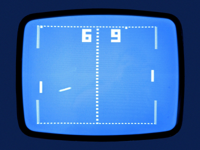
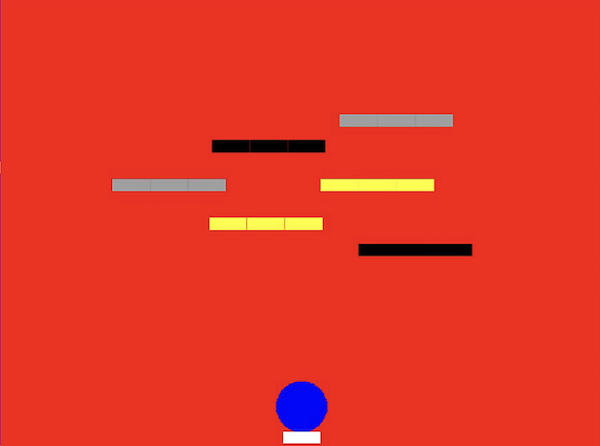
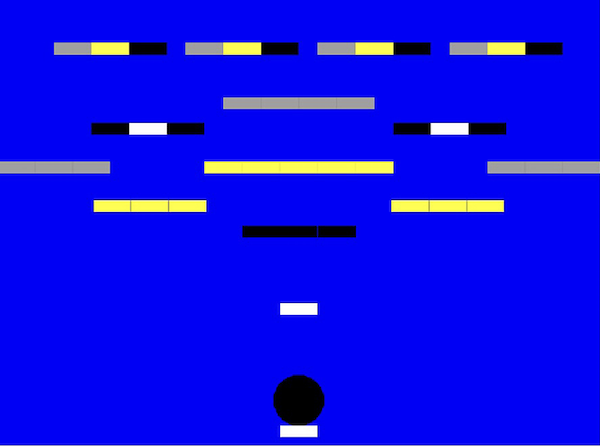

[Previous Section: Exercise](2_EXERCISE.md)

# Module 5: Project

## Game

## Instructions

In this project you are going to combine the code that you worked on in the previous exercise to create a **fully functioning game of digital tennis**.

One of the most important skills in computer programming is being able to **break down a large problem into smaller problems**. That's why we've broken this module's objectives down into several different parts and are building things up gradually!

By the end of this project you will have object oriented code that is reusable in a variety of contexts.

## Instructions

There will be several challenges to this  project. If you are working in a group these challenges can be divided among you.

### Step 1: Confirm that your  workshop code is encapsulated well in either object oriented notation or functions, whichever makes the most sense. 

Make your code from the workshop is in **object oriented notation or functions**. Make sure that global variables are minimized and any data you need is  passed in via object initializers, dot operators, or function  parameters. If you are confused about how to do this, you may review the content in **Module 4 (Functions)** or **Module 5 (Objects)**.

**Hint:** At this stage, it makes the most sense for collision detection to exist as a function that returns a boolean.

### Step 2: Combine all of your code to create a single digital tennis game.

Instead of single paddle, create two  instances of your paddle object. For now both paddles will be controlled by `touchX` and `touchY` and will mirror each other. This will enable you to debug the game.

### **Step 3: Add a score to your game**

As in many games, the **score is important!** It's how the game determines who has won or lost. Scores also help your players to get a sense of satisfaction from their game playing experience.

You can follow whatever scoring rules you'd like to make the game your own.

The score could be an object, and be programmed in object oriented notation. That means you will have **two instances of the score class** on your screen.

### Step 4: Customize the look and feel of your game.

Brainstorm possible concepts that will make your game unique. First decide on a  look that you will use to set your digital tennis game apart. For full credit, **your game must have a unique look that is more than just superficial color changes**.

Then, think about ways to also make the game play unique. **Possible ways to customize your game** include:

- Modified rules.
- Modified game dimensions.
- Multiple balls.
- Color
- A metaphor other than tennis.
- Obstacles other than the paddles for the ball to bounce off of.
- Add a life system.
- Add a level system.
- Make it possible to "win" the game.
- Add a main menu or splash screen
- Add a game over screen.
- Use images instead of shapes.

**Important:** **Explain your concept** for your digital tennis game and how you've modified it **in your header** at the top of your code.

### **Step 5: Make your game self-contained.**

Think about the user of your game. Make it so that your user **never has to restart or reload your code**. Make sure when the game is over, the players are given the chance to play again, or restart the game.

## Student Examples

**Note:** The examples I provide are meant to only give you an idea of what's expected. **Do not copy them. All of your ideas in this course must be original.** Create your own approach to all assignments. Copies will receive no credit.

The following are student examples used with permission:

Sketch by Dana Nugumanova. Dana used her illustration skills to create a game about a girl who broke a necklace and was trying to catch the pearls as they bounced around in her bathroom.

Sketch by Mookyung Sohn. Mookyung created a variation of the original game of Breakout with a unique and bright primary and secondary color palette with a larger ball. The game has a strong visual sensibility and is a unique take on the assignment.

## Rubric

**Note:** Code must function in order to earn credit.

| Criteria                                                     | Points |
| ------------------------------------------------------------ | ------ |
| **Technique** - Contains all required code for **original Pong game**. - All components are written in **object oriented notation**, with the exception of collision detection. | 1 pt   |
| - Collision detection is written as a function that returns a `boolean` (true/false). - Game runs without glitches and **collisions with ball, wall, and paddle happen at the right place** (i.e. on the correct edges) | 1 pt   |
| **Conceptual Understanding** - Game is **fully customized** to reflect a concept. Code **must include more than subtle esthetic changes** to the original game of Pong (i.e. no simple color changes). - A comment at the top of your code **explains in detail what your concept was** and how the game has been customized. | 1 pt   |
| - **Instructions** are included in the header for how to play. - Game keeps the player in the game environment. It **doesn't require restarting the code to play again**. | 1 pt   |
| **Presentation** - **Important:** If you worked in a group, **describe who did what in your header**. - Code has a clear, descriptive **header**. - Code is helpfully **commented** for your future self. Code is **auto-formatted** (select all and control-i) so that tabs are correct. - The code is presented neatly **without** commented out code. | 1 pt   |

[Next Section: Module 7](../7_Final_Project/README.md)

