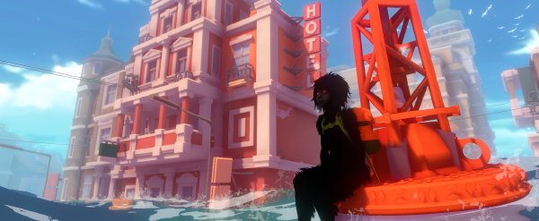
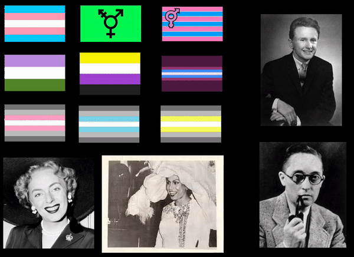

[Previous Section: Final Proposal](1_FINAL_PROPOSAL.md)

# Module 7: Final Project

## 

Screenshot from *Sea of Solitude*, a Games for Change award-wining game with a mental health theme.

## Introduction

As artists and designers we learn to **change and shape the world around us**. From a design perspective, designers create the products that fill our store shelves and populate our many screens. But designers also create products that end up in land fills or cause harm to people and the environment.

As artists, we may create a project that stimulates us visually, but **what does the art actually do?** **Who does it serve?** And **what kinds of materials and processes are we using to create it?**

Being a **conscientious** and **ethical** maker means understanding how the things we make function in the world. It means seeing every project as an opportunity to be a part of a conversation toward **the greater good**.

This project is based on the growing movement of [Design for Change](https://www.designforchange.us/) and [Games for Change](http://www.gamesforchange.org). Follow the links to learn more!

## Assignment

For this assignment you will choose at least one of several different topics and create a project that explores it.

***Create something you feel strongly about!***

You will be required to **research** your topic and **provide evidence** of your research and **how you applied it** to your project.

## Possible Categories

Sustainability/Environmentalism. Social Justice. Human Culture. Animal Welfare. Physical/Mental Health. Neurodiversity (dyslexia, autism spectrum, ADHD, etc.). Safety/Security. Privacy. Surveillance. Spirituality. Indigenous Peoples. Human Trafficking. Human Sexuality. Transgender Identity. Immigration. Politics. History. Philosophy. War and Conflict.

There is a [list of global issues available on Wikipedia](https://en.wikipedia.org/wiki/List_of_global_issues) as well that may be a good starting point.

NOTE: These are **not the only possible categories**. If you have other ideas, just contact me to talk about it first.

## Research

Your project must be **based on peer-reviewed research**. You will use a variety of sources to complete your project. You will have **technical research** and **content research**. You must have at least **5 sources of content research** and **3 sources of technical research**.

**Technical Research** has  to do with how you will practically achieve your project. This can be in the form of tutorials, technical reference books, articles, or  technical papers.

**Content research** is directly related to the topic of your research project. This is the content that you will put into your project.

Only projects with **varied sources** will receive full credit. **If all research comes from the internet, you will not get credit for research.**

Wikipedia is **not allowed** as a source, but consider looking at the bibliographies in Wikipedia entries as **a starting point** to find sources.

Possible **sources** include: Library Books. Magazines. Expert Interviews. Podcasts. Web sites (web sites must have sources and based on real research). Encyclopedia. Published Studies. Surveys. Case Studies. Playtesting.

## Bibliography

All of the sources for your research must be listed in an **annotated** **bibliography**.

Use the **APA style** to list your sources. You can use [Purdue's OWL website](https://owl.english.purdue.edu/owl/resource/560/01/) to learn about the APA style. Write a **concise annotation** that summarizes the central theme and scope of the book or article. Include one or more sentences that:

1. Evaluates the **authority** or **background** of the author.
2. Comments on the **intended audience**.
3. **Compares or contrasts** this work with another you have cited.
4. Explains how this work **illuminates** your bibliography topic.

## Deliverables

- **Research**: Provide the required amount of research. Use the APA style for your annotated bibliography and save it as a PDF.
- **Statement**: Write a short statement (1 small paragraph) describing the intentions of your project.
- **Final Project**: If your project is a physical object you will need to photograph and  document your project thoroughly to turn it in on Canvas. All elements  of your projects must be documented.
- Include a **functioning copy of your project** with **instructions** on how to use the file. **Provide a functioning file. Do not provide links.**

## Student Examples

**Note:** The examples I provide are meant to only give you an idea of what's expected. **Do not copy them. All of your ideas in this course must be original.** Create your own approach to all assignments. Copies will receive no credit.

The following are student examples used with permission:

Sketch by Cat Thoss. In Cat's final project, she explores her Korean-American heritage by conducting interviews with her grandmother, who immigrated from Korea. Using photographs, an audio voice-over, and a 3D exhibition space, Cat invites the viewer to interactively walk through the life story of her subject and learn about Korean-American history.

This project, called *The Great Journey*, was created by a student who wanted to tell the story of a relative who crossed the southern border of the United States to find a better life for their family. The game is designed around the dangers faced in the difficult journey. The student created 3 levels and incorporated aspects of their family's actual experience in the game elements and cut scenes.

Sketch by Esme Puzio. Esme's final project was to create a system that teaches people strategies for coping with anxiety and panic disorders. Her research centered around breathing techniques and cognitive behavioral therapy.

Sketch by Will Hazlinger. Will's final project is an exploration of transgender, gender non-conforming, and demigender history through an exploration of 9 historical flags, images of prominent figures, music, and text. As users scroll over images, information is given and various historically important anthems play in the background.

Sketch by Kelly To. Kelly explored the history and practice of redlining and gentrification. Her research focussed on how the practice keeps populations of people of color vulnerable to financial/housing instability and health problems and how its legacy continues to this day.

## Rubric

**Note:** Code must function in order to earn credit.

| Criteria                                                     | Points |
| ------------------------------------------------------------ | ------ |
| **Final Project** - Project is **complete** per the scope outlined in the proposal. - **Runs without intervention**, contains no glitches. - Clearly **reflects the intentions and ideas** put forward in the research and statement. | 4 pt   |
| **Research** - Project has an **annotated bibliography** in the correct APA style as a PDF. - The research done is **clearly applied to your project** in a clear way. NOTE: Research done after the fact or "tacked on" will not count toward your project. | 4 pt   |
| **Statement** - Contains a short **written statement** that clearly explains what the project does/is. - Statement contains **no typos or misspellings**, and uses **correct grammar**. - Uploaded as a **PDF**. | 4 pt   |
| **Presentation** - **Important:** If you worked in a group, **describe who did what in your header**. - Code has a clear, descriptive **header**. - Code is helpfully **commented** for your future self. - Code is **auto-formatted** (select all and control-i) so that tabs are correct. - The code is presented neatly **without** commented out code. | 4 pt   |

