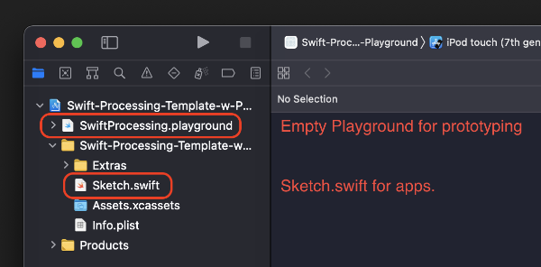
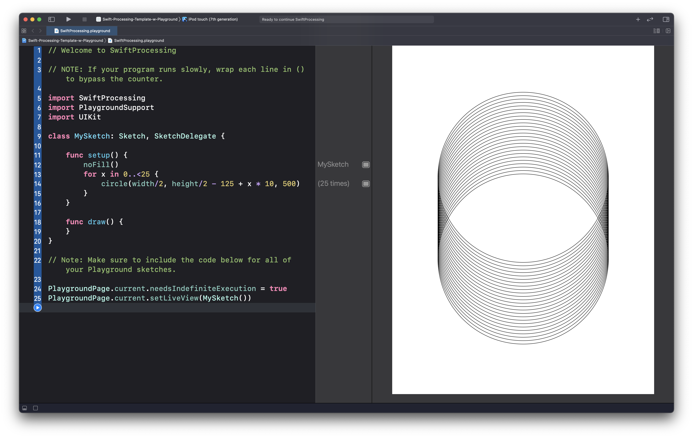
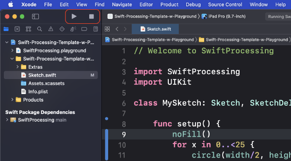
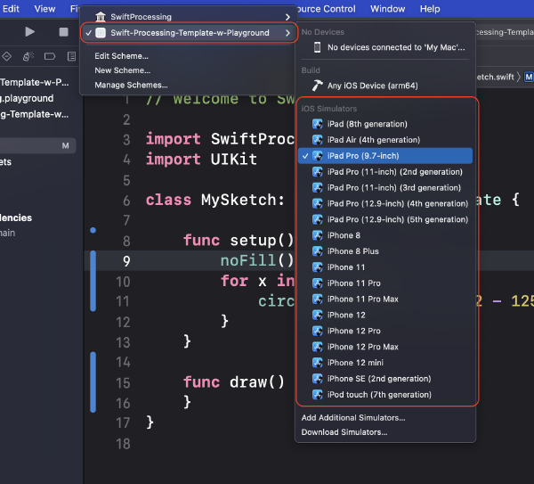
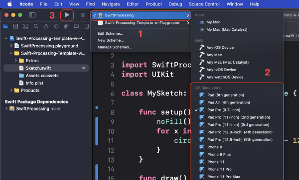
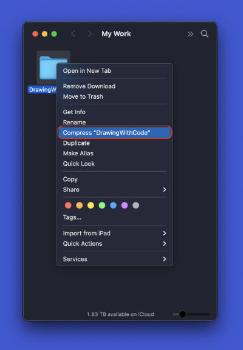

# Frequently Asked Questions

## Table of Contents

- [SwiftProcessing and Xcode](#swiftprocessing-and-xcode)
  - [Where do I write my code?](#where-do-i-write-my-code)
  - [What is a Playground?](#what-is-a-playground)
  - [How do I run my Playground?](#how-do-i-run-my-playground)
  - [How do I run my Sketch.swift file?](#how-do-i-run-my-sketchswift-file)
  - [What things should I check if my file isn't running?](#what-things-should-i-check-if-my-file-isnt-running)
  - [If nothing works and my template still won't run what else can I do?](#if-nothing-works-and-my-template-still-wont-run-what-else-can-i-do)
- [macOS](#macos)
  - [How do I take a screen grab?](#how-do-i-take-a-screen-grab)
  - [How do I create a zip file from a folder?](#how-do-i-create-a-zip-file-from-a-folder)

## SwiftProcessing and Xcode

### Where do I write my code?

The **[Empty App Template](https://github.com/masoodkamandy/Swift-Processing-Template-w-Playground/archive/refs/heads/main.zip)** I provide for my students has two possible locations to code in. One is the **`SwiftProcessing.playground`**, which is an Xcode Playground file. The other is a Sketch.swift file. You can code in either places, but they have different purposes.

#### **Playgrounds** are good for:

- Prototyping or testing something out.
- A good starting point for most projects.
- Any project that can be contained in a single file.

#### **`Sketch.swift`** is good for:

- Writing an app that works on a phone or tablet.
- Anything that requires speed or is more complex.
- Any project where you need to use more than one file. You can use multiple `.swift` files as your project becomes more comlex.



[Table of Contents](#Table-of-Contents)

### What is a Playground?

Xcode Playgrounds are a programming environment that allows for rapid prototyping with a live view. Rather than having to compile and run software on a hardward device or in a simulator, the results of your programming appear next to your code inside of the development environment.



[Table of Contents](#Table-of-Contents)

### How do I run my Playground?

Your playground has two buttons in the lower left-hand corner of the interface that will help with the execution of your code.


In the **bottom left corner of the window** there is a button that is either a ▶️ button or a ⏹ button. This is for running your code the first time and starting/stopping the compiler.

On the left side of the window beside the code there is a **blue ▶️ button**. This is for re-running your code quickly when you've made small changes. This will be faster than the other button.

**Note**: If your code or the editor begins **running slowly**, press the ⏹ button and you'll notice that the environment will become more responsive.

[Table of Contents](#Table-of-Contents)

### How do I run my Sketch.swift file?

At the top of your template's main interface you will see a ▶️ button or a ⏹ button. These are the **build** and **stop** buttons in Xcode. ▶️ will compile your code and open up the **Simulator** for whichever device you would like to simulate.



To choose a simulator, click on the button to the right of the stop button and select your simulator. **Note**: You want to make sure you keep `Swift-Processing-Template-w-Playground` checked after you pick a simulator.



[Table of Contents](#Table-of-Contents)

### What things should I check if my file isn't running?

Getting the hang of an Xcode workflow can be intimidating at first, but once you know what things to check when things go wrong, you'll become accustomed to it. Here are a few tips for the two methods for coding in SwiftProcessing that you can follow if things go wrong.

#### General Suggestions

- Check that all `{` is accompanied with a `}`.
- Check your tabs by choosing **Edit > Select All** (or **command-a**) and then **Editor > Structure > Re-Indent** (**control-i**). This will reformat your code with proper tabs and will show you when there is a misplaced bracket.

#### Playgrounds

- Make sure your Playground code follows this format:

  ```swift
  // 1
  import SwiftProcessing
  import PlaygroundSupport
  import UIKit
  
  // 2
  class MySketch: Sketch, SketchDelegate {
      
      // 3
      func setup() {
      }
      
      // 4
      func draw() {
      }
  }
  
  // 5
  PlaygroundPage.current.needsIndefiniteExecution = true
  PlaygroundPage.current.setLiveView(MySketch())
  ```

  The commented numbers in the example refer to:

  1. Import statements
  2. The line that starts with `class` which gives us access to all of SwiftProcessing's features.
  3. `setup()` which runs once when a sketch first launches.
  4. `draw()` which runs at 60 frames per second (by default) and loops until the sketch is stopped.
  5. This sets up the Playground's live view. If this is missing, you will receive no error and it will **simply do nothing**. This is a **common error** in Playgrounds.

- If the Playground is giving you console errors about missing methods, **try pressing the Play button a second time**. Sometimes when a project is first run, it takes a couple of plays before the Playground will see all of the available code.

- If you're still getting errors about missing methods or an error that says SwiftProcessing was not found, then switch to the SwiftProcessing library build target, click build, and try to play the Playground again. Follow the steps in the image below:
  

  1. Select the **SwiftProcessing build target** in the choices to the right of the build and stop buttons.
  2. Select any **target iOS device**.
  3. Hit the build (▶️) button to **rebuild the library**.
  4. Go back to your Playground and try to **play it again**.

#### Sketch.swift

- Make sure your code follows the following format similar to the code above. Notice that there doesn't need to be  quite as much code as in the Playground code:

  ```swift
  import SwiftProcessing
  import UIKit
  
  class MySketch: Sketch, SketchDelegate {
      func setup() {
      }
      
      func draw() {
      }
  }
  ```

- Make sure that you've **chosen a simulator** to use that matches what you'd like to develop on.

[Table of Contents](#Table-of-Contents)

### If nothing works and my template still won't run what else can I do?

There are times when Xcode just needs a reboot. Xcode is fairly good about saving your files, but if things won't work, a good thing to sometimes try is just save your changes with Command-s, quit, and relauch. This can sometimes fix some errors.

If this does not work, you can also clean your build folder by selecting **Product > Clean Build Folder** or **Command-Shift-k**. This erases any files that were created in previous builds and starts fresh.

[Table of Contents](#Table-of-Contents)

## macOS

### How do I take a screen grab?

In macOS you can take a screen grab with a keyboard combination.

**Command-Shift-3** takes a screen grab of your **entire screen**.

**Command-Shift-4** takes a screen grab of a **selected area**.

Pressing the **space bar** after you've entered selection mode will allow you to **capture a window**.

Your image files will save to your desktop.

Add a **Control** to either of the above methods and you will **copy your screen grab to the clipboard** rather than create a file.

[Table of Contents](#Table-of-Contents)

### How do I create a zip file from a folder?

In macOS you can create a zip file by **right or control-clicking any file** and choosing **Compress File**.



[Table of Contents](#Table-of-Contents)

[Next Section: Module 1](1_DrawingWithCode/README.md)
